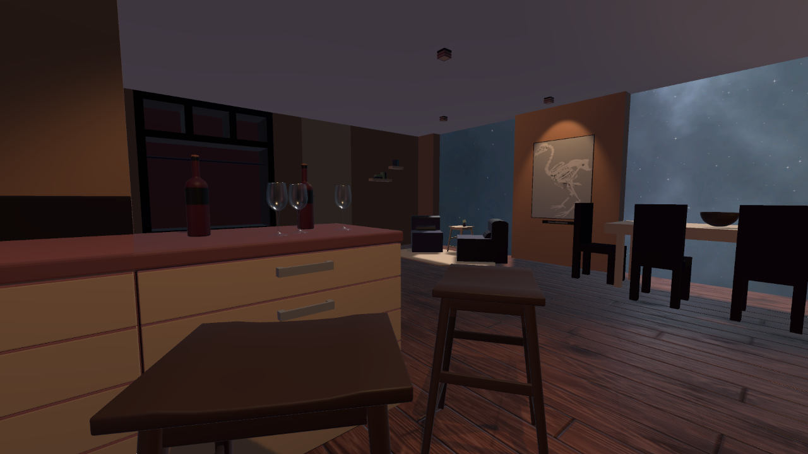

# Astral Apartment
A space apartment I designed from scratch and created in Unity.

## Description
The main goal of this project was to get more familair with Unity. I also wanted to test my previously acquired skills of architectural drawing and GDD writing.

## Live demo
The project is hosted live and can be found [here](https://nakerthefirst.github.io/Astral-apartment/).

## Screenshots & sketches

